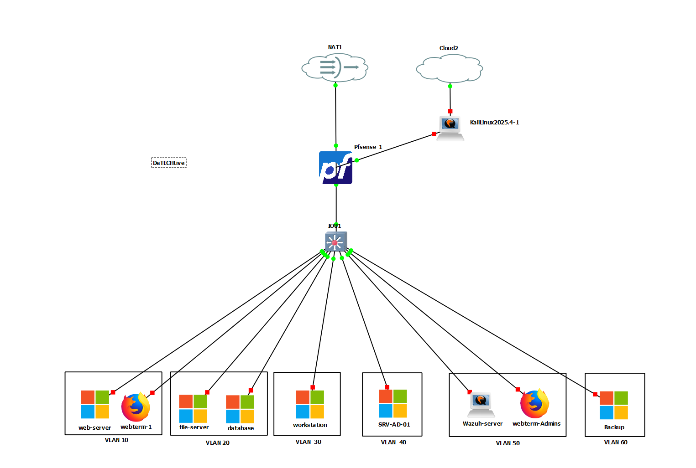
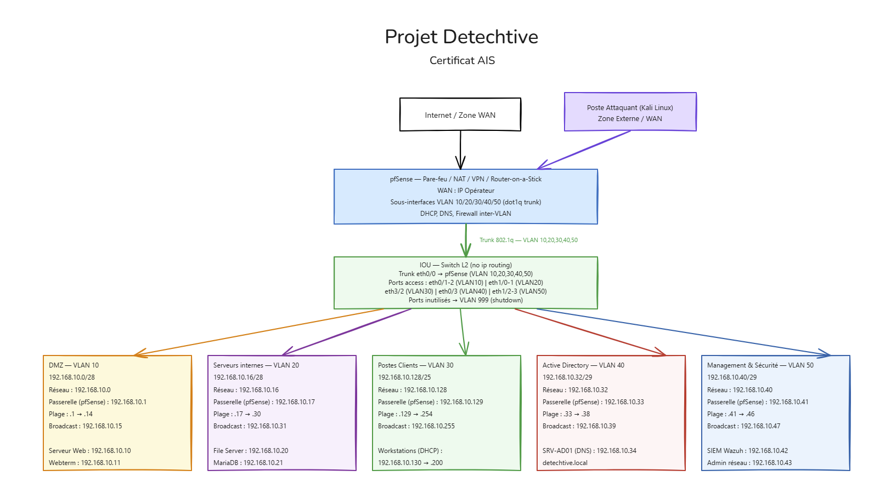

# 🕵️‍♂️ Detechtive Agency - Secure Infrastructure & Intranet

> **Projet de fin d'études - Certification AIS (Administrateur d'Infrastructures Sécurisées)**
> *RNCP Niveau 6*

---

## 📖 À propos

**Detechtive Agency** est un projet de mise en situation réelle simulant le déploiement d'une infrastructure sécurisée pour une agence de renseignement. Le projet couvre la conception de l'architecture réseau, la virtualisation, le durcissement des systèmes (Hardening) et le développement d'un intranet métier interconnecté aux services d'infrastructure critiques.

🎯 **Objectif :** Démontrer la capacité à concevoir une architecture **"Secure by Design"** en segmentant le réseau en zones de sécurité distinctes, en chiffrant les communications de bout en bout, en assurant la continuité d'activité via une solution de sauvegarde isolée, et en garantissant l'interopérabilité entre une application Web et un domaine Active Directory.

---

## 🏗️ Architecture & Infrastructure

L'infrastructure est entièrement virtualisée et émulée via **GNS3**. Elle repose sur une segmentation stricte en VLANs pour limiter les mouvements latéraux et réduire la surface d'attaque.

Le **switch IOU** opère en **L2 pur** (`no ip routing`) et assure le transport des VLANs via un trunk 802.1q vers pfSense. Le **pare-feu pfSense** est positionné en **Router-on-a-Stick** : il assure à la fois le routage inter-VLAN, le filtrage périmétrique et le NAT via **6 sous-interfaces VLAN dédiées** (IP passerelles directement portées par pfSense).

### 🗺️ Topologie Réseau

Le réseau est cloisonné en **6 zones de sécurité** indépendantes, chacune avec un niveau de confiance et des droits d'accès distincts.

| Zone | VLAN | CIDR | Passerelle (pfSense) | Plage IP | Services Hébergés | Niveau de confiance |
| :--- | :---: | :--- | :--- | :--- | :--- | :---: |
| **DMZ** | `10` | `192.168.10.0/28` | `192.168.10.1` | `.2 → .14` | Serveur Web Apache/PHP (`192.168.10.10`), Webterm (`192.168.10.11`) | 🔴 Faible |
| **Serveurs Internes** | `20` | `192.168.10.16/28` | `192.168.10.17` | `.18 → .30` | File Server (`192.168.10.20`), Base de Données MariaDB (`192.168.10.21`) | 🟠 Moyen |
| **Postes Clients** | `30` | `192.168.10.128/25` | `192.168.10.129` | `.130 → .254` | Workstations des agents Windows (DHCP `.130→.200` géré par pfSense) | 🟡 Standard |
| **Active Directory** | `40` | `192.168.10.32/29` | `192.168.10.33` | `.34 → .38` | Contrôleur de Domaine SRV-AD-01 / DNS (`192.168.10.34`) | 🔴 Critique |
| **Management & Sécurité** | `50` | `192.168.10.40/29` | `192.168.10.41` | `.42 → .46` | SIEM Wazuh (`192.168.10.42`), Administration réseau (`192.168.10.43`) | 🔴 Critique |
| **Backup & Restauration** | `60` | `192.168.10.48/29` | `192.168.10.49` | `.50 → .54` | NAS/Serveur Backup (`192.168.10.50`) | 🟢 Isolé |
| **Zone Externe** | `-` | `WAN` | - | - | Poste Attaquant (Kali Linux) — Pentest | ⚫ Non fiable |

### 🔒 Principes de segmentation & règles pfSense

- **DMZ (VLAN 10) → VLANs internes (20/30/40/50/60) :** BLOCK par défaut. **Exceptions :** Serveur Web (`192.168.10.10`) → MariaDB VLAN 20 sur port `3306/TCP`, et → File Server VLAN 20 sur port `445/TCP` (SMB).
- **VLAN 40 (AD) :** Totalement isolé de la DMZ. Accessible depuis les VLANs 20, 30 et 50 sur les ports LDAP (`389`), LDAPS (`636`) et DNS (`53`) autorisés.
- **VLAN 50 (Wazuh) :** Collecte les logs de tous les VLANs en lecture seule (ports `1514/1515`). Aucun flux entrant depuis la DMZ n'est autorisé vers ce VLAN.
- **VLAN 60 (Backup) :** Zone passive — reçoit les sauvegardes depuis VLAN 20 (Serveurs) et VLAN 40 (AD) sur port `9102/TCP` uniquement. **Aucun flux sortant autorisé** (sauf logs vers Wazuh). Accès Internet bloqué (protection anti-ransomware).
- **LAN internes → Internet :** ALLOW sortant, logs activés et envoyés vers Wazuh (VLAN 50).
- **WAN entrant :** Seuls les ports `80/443` (NAT vers `192.168.10.10`) et `51820/UDP` (VPN WireGuard — tunnels admin & développeurs) sont ouverts. Tout le reste est BLOCK/DROP avec log vers Wazuh.
- Le poste **Kali Linux** est positionné avant pfSense (zone WAN) pour simuler un attaquant externe réaliste sans accès au réseau interne.

### 📸 Vue Logique (GNS3)

*Schéma conceptuel et plan d'adressage IP :*

---

## 🛠️ Stack Technique

### 🖥️ Virtualisation & Réseau

* **Hyperviseur / Émulateur :** GNS3 (gestion de la topologie), VMware Workstation.
* **Switch L2 :** IOU (mode L2 pur — `no ip routing`) — **6 VLANs (10, 20, 30, 40, 50, 60)**, trunk dot1q vers pfSense sur `ethernet 0/0`. Ports inutilisés affectés au VLAN 999 et `shutdown`.
* **Routage inter-VLAN & Sécurité Périmétrique :** pfSense en **Router-on-a-Stick** — **6 sous-interfaces VLAN**, Firewalling granulaire, NAT, VPN WireGuard (port `51820/UDP`), Syslog vers Wazuh (`192.168.10.41:514`).
* **Sauvegarde & Restauration :** NAS/Serveur Backup (`192.168.10.50`) — VLAN 60 totalement isolé, sauvegardes unidirectionnelles depuis SERVERS et AD.
* **Supervision de Sécurité :** Wazuh (SIEM & XDR) — collecte d'alertes sur l'ensemble des VLANs depuis le VLAN 50 dédié.

### ⚙️ Systèmes & Services (Full Windows)

Toute l'infrastructure serveur repose sur **Windows Server 2022** pour assurer une cohérence d'administration via l'Active Directory.

* **Serveur AD (SRV-AD-01) — VLAN 40 — `192.168.10.34` :** Active Directory DS, DNS. Isolé dans un VLAN dédié, inaccessible depuis la DMZ.
* **Serveur de Fichiers (FS) — VLAN 20 — `192.168.10.20` :** Stockage des preuves, partages SMB sécurisés, quotas.
* **Serveur Web — VLAN 10 (DMZ) — `192.168.10.10` :**
  * OS : Windows Server 2022
  * Serveur HTTP : Apache (XAMPP/WAMP customisé)
  * Langage : PHP 8.x
* **Serveur Base de Données — VLAN 20 — `192.168.10.21` :**
  * OS : Windows Server 2022
  * SGBD : MariaDB (MySQL)
* **NAS/Serveur Backup — VLAN 60 — `192.168.10.50` :**
  * Zone passive dédiée aux sauvegardes (BorgBackup ou équivalent)
  * Aucun accès Internet, aucun flux initié vers les autres VLANs

### 💻 Application Intranet ("Detechtive Dashboard")

* **Frontend :** HTML5 / CSS3 (Design "Terminal" immersif).
* **Backend :** PHP Natif sécurisé.
* **Outils de gestion de projet :** Trello (Kanban), Excalidraw (Schématisation).

---

## 🔐 Implémentations Sécurité (Focus AIS)

Ce projet met en œuvre une défense en profondeur, du réseau à la couche applicative.

### 1. Segmentation réseau (Defense in Depth)

* **6 VLANs isolés** avec règles pfSense strictes par interface VLAN (whitelist par port/service, pas de règles "any to any").
* Le **Serveur Web est en DMZ** (VLAN 10 — `192.168.10.10`) : une compromission n'expose ni l'AD, ni les données internes.
* **L'AD est isolé** dans VLAN 40 (`192.168.10.34`) : inaccessible depuis Internet et depuis la DMZ.
* **Wazuh est isolé** dans VLAN 50 (`192.168.10.42`) : un attaquant qui compromet la DMZ ne peut pas désactiver la supervision.
* **Le Backup est isolé** dans VLAN 60 (`192.168.10.50`) : un attaquant (ransomware) ne peut pas chiffrer les sauvegardes — elles sont inatteignables depuis la DMZ et depuis Internet.

### 2. Continuité d'activité & Sauvegarde (VLAN 60)

* **Zone passive dédiée :** Le VLAN 60 (`192.168.10.48/29`) héberge le NAS/Serveur Backup sur `192.168.10.50`.
* **Flux unidirectionnels :** VLAN 20 (Serveurs) et VLAN 40 (AD) poussent les sauvegardes vers le VLAN 60 sur port `9102/TCP`. Le backup ne peut initier aucune connexion sortante.
* **Protection anti-ransomware :** Accès Internet depuis VLAN 60 bloqué par règle pfSense. Un ransomware qui compromet un serveur ne peut pas atteindre le backup.
* **Règle 3-2-1 :** Base pour évoluer vers 3 copies, 2 supports différents, 1 hors-site.
* **Supervision :** Logs du backup remontés vers Wazuh SIEM (`192.168.10.42`) en lecture seule.

### 3. Chiffrement des Flux Critiques

* **HTTPS Strict :** L'application web n'est accessible que via TLS (certificat auto-signé ou autorité privée).
* **Database SSL/TLS :** La connexion entre le backend PHP et MariaDB (`192.168.10.21`) est chiffrée.
  * *Détail technique :* Utilisation de `PDO::MYSQL_ATTR_SSL_CA` pointant vers le certificat CA (`ca-cert.pem`) pour prévenir les attaques Man-in-the-Middle.
* **Vérification Active :** Le dashboard affiche en temps réel le statut du chiffrement SQL (`Ssl_cipher`).

### 4. VPN WireGuard (Deux tunnels distincts)

* **Protocole :** UDP, Port `51820` sur l'interface WAN de pfSense.
* **Plage VPN :** `10.10.10.0/24` (réseau virtuel WireGuard) — IP tunnel pfSense : `10.10.10.1`.
* **Tunnel Administrateurs :** Accès aux VLAN 40 (AD), VLAN 50 (Management) et VLAN 60 (Backup). Réservé aux administrateurs système pour gérer pfSense, l'AD, Wazuh et les sauvegardes sans exposer RDP/SSH.
* **Tunnel Développeurs :** Accès aux VLAN 10 (DMZ — serveur web) et VLAN 20 (Serveurs internes — MariaDB, File Server). Permet les déploiements et la maintenance applicative sans droits d'administration infrastructure.
* **Règle commune :** Le VLAN 30 (postes clients) est inaccessible depuis les deux tunnels.
* **Justification :** Séparation des profils d'accès selon le principe du moindre privilège — les développeurs n'accèdent pas aux zones d'administration, et les administrateurs n'ont pas accès aux ressources applicatives en dehors de leur périmètre.

### 5. Gestion des Identités & Interopérabilité

* **Authentification Centralisée :** Les utilisateurs sont gérés via l'Active Directory (`detechtive.local` — VLAN 40).
* **Interopérabilité PHP ↔ SMB :** L'application web ne stocke pas les fichiers localement. Elle s'authentifie dynamiquement sur le File Server via `net use` pour monter les partages sécurisés uniquement le temps de la session.

### 6. Sécurité Applicative (AppSec)

* **Upload Sécurisé :**
  * Whitelist d'extensions stricte (jpg, png, pdf, docx...).
  * Renommage forcé des fichiers pour éviter les injections de commandes.
  * Vérification de la taille (Max 5 Mo).
* **Protection SQL :** Requêtes préparées (`PDO`) systématiques contre les injections SQL.
* **Gestion d'erreurs :** Mode silencieux en production avec système de fallback si SSL échoue, et alerte administrateur.

---

## 🚀 Installation / Déploiement (Simulation)

> ⚠️ **Note :** Le code source complet est privé. Ce dépôt sert de vitrine technique.

Pour reproduire cet environnement sous GNS3 :

1. Importer les appliances (pfSense, Windows Server 2022, Kali Linux, Webterm, NAS/Backup).
2. Configurer le switch IOU en **L2 pur** (`no ip routing`) — **6 VLANs (10, 20, 30, 40, 50, 60)** + trunk dot1q vers pfSense sur `ethernet 0/0`. Affecter les ports inutilisés au VLAN 999 et les `shutdown`.
   - VLAN 60 (Backup) : `eth2/0` et `eth2/1` en mode access.
3. Configurer pfSense en **Router-on-a-Stick** :
   - Créer **6 sous-interfaces VLAN** sur l'interface connectée à l'IOU :
     - VLAN 10 → `192.168.10.1`, VLAN 20 → `192.168.10.17`, VLAN 30 → `192.168.10.129`
     - VLAN 40 → `192.168.10.33`, VLAN 50 → `192.168.10.41`, VLAN 60 → `192.168.10.49`
   - VPN WireGuard : UDP `51820`, tunnel `10.10.10.0/24`.
   - Syslog : remote log server `192.168.10.42:514`, source `192.168.10.41`.
4. Déployer les règles de pare-feu pfSense par interface VLAN :
   - WAN → NAT HTTP/HTTPS vers `192.168.10.10` (Serveur Web DMZ).
   - DMZ → VLAN 20 : ports `3306/TCP` (MariaDB) et `445/TCP` (File Server SMB) uniquement.
   - DMZ → VLAN 40/50/**60** : **BLOCK**.
   - VLAN 30 → VLAN 40 : LDAP `389`, LDAPS `636`, DNS `53` uniquement.
   - VLAN 30 → VLAN 60 : **BLOCK**.
   - VLAN 20 et VLAN 40 → VLAN 60 : port `9102/TCP` uniquement (backup unidirectionnel).
   - VLAN 60 → Tous VLANs : **BLOCK** (sauf logs Wazuh `1514/1515`).
   - VLAN 60 → Internet : **BLOCK** (anti-ransomware).
   - Tous VLANs → Wazuh `192.168.10.42` : ports `1514/1515` (logs, lecture seule).
   - LAN internes → Internet : ALLOW sortant avec logs.
5. Initialiser l'Active Directory et joindre les serveurs Web, BDD et FS au domaine `detechtive.local`.
6. Configurer les agents Wazuh sur chaque serveur pour remonter les alertes vers `192.168.10.42` (VLAN 50).
7. Déployer et configurer le NAS/Serveur Backup (`192.168.10.50`) — configurer les jobs de sauvegarde depuis SERVERS (VLAN 20) et AD (VLAN 40).

---

*Projet réalisé dans le cadre de la certification RNCP Niveau 6 "Administrateur d'Infrastructures Sécurisées"*
